# Todo Web App

Repository to contain and document React Client and Spring REST API implementation.
This repository contains two submodules of each system (front-end and back-end).

## API Documentation

Full API documentation can be found in [**postman documentation
**](https://documenter.getpostman.com/view/20896360/2sAXxS9Bos).

## User Interface

### Register

| State    | Image                                           |
|----------|-------------------------------------------------|
| Unfilled | 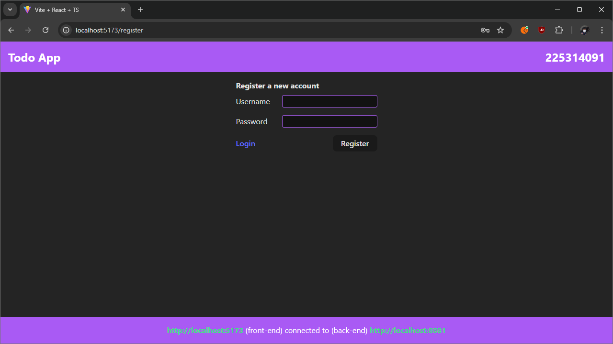 |
| Success  | 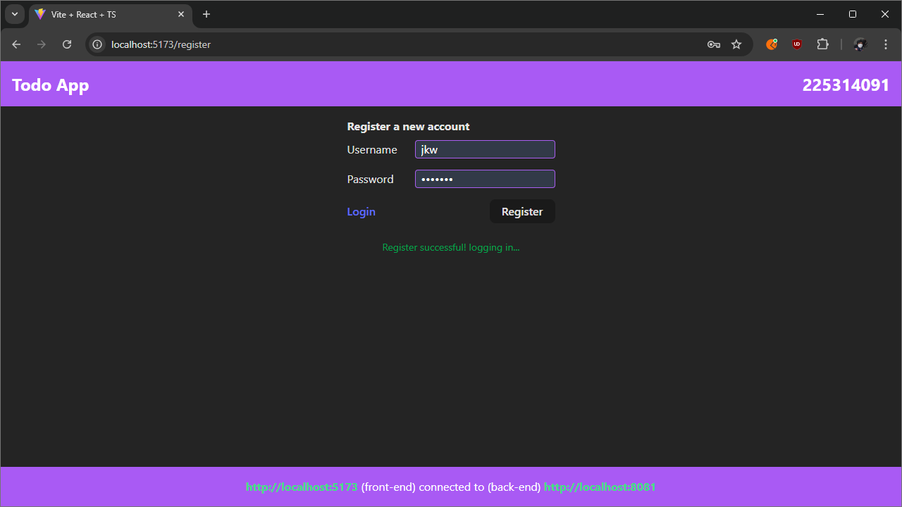  |
| Error    | 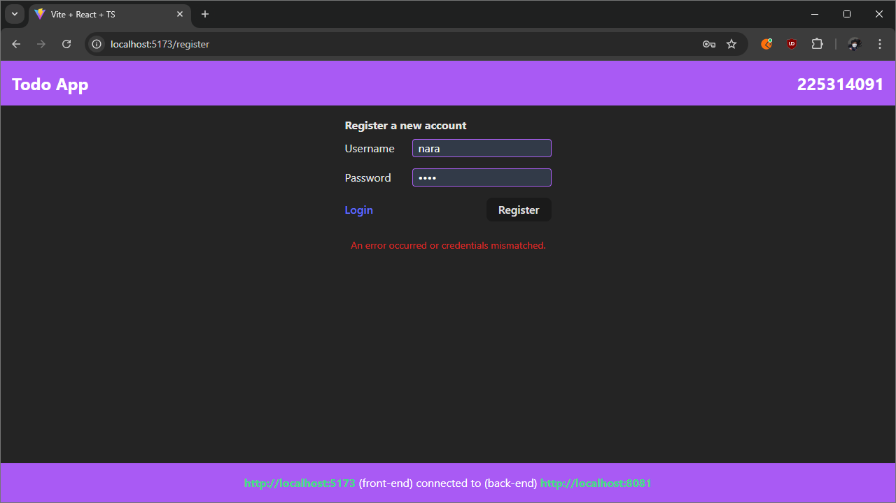    |

### Login

| State    | Image                                     |
|----------|-------------------------------------------|
| Unfilled | 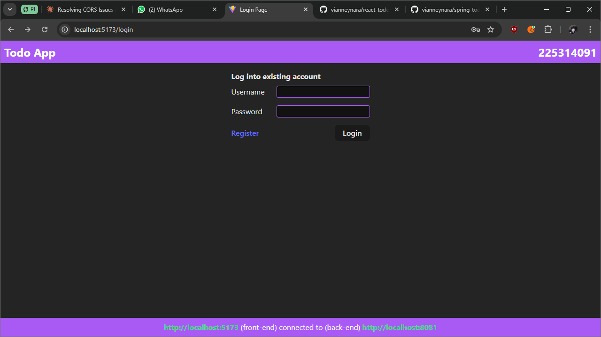 |
| Success  | 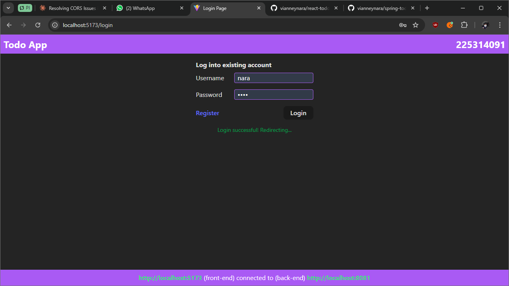  |
| Failed   |    |
| Error    | 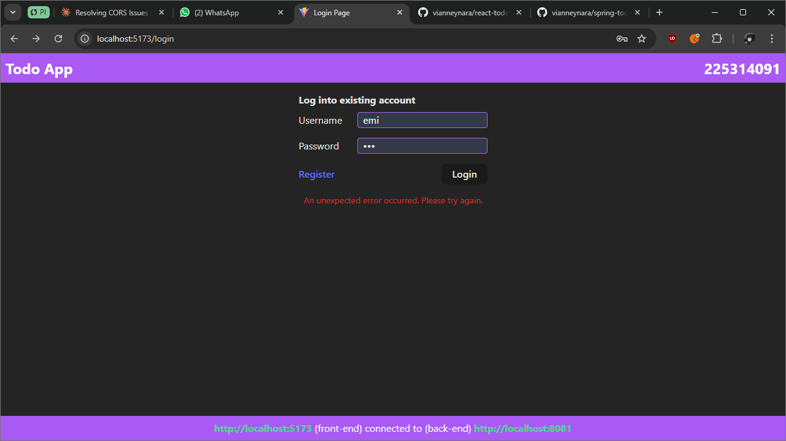    |

### Todo Dashboard

| State  | Image                                                                                       |
|--------|---------------------------------------------------------------------------------------------|
| Idle   | 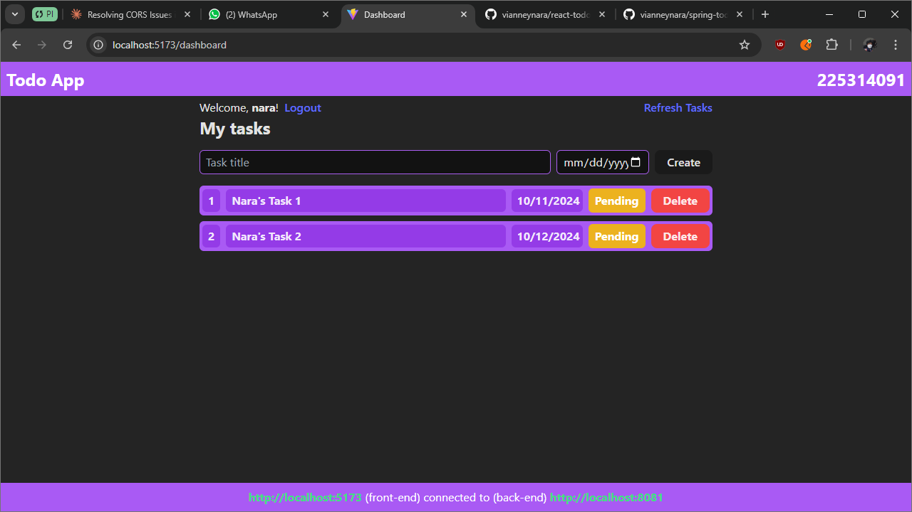                                                    |
| Add    | 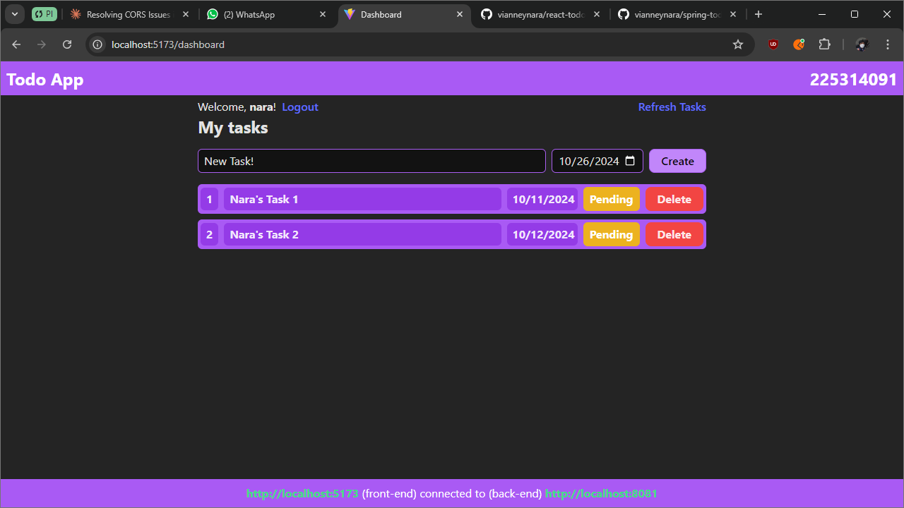 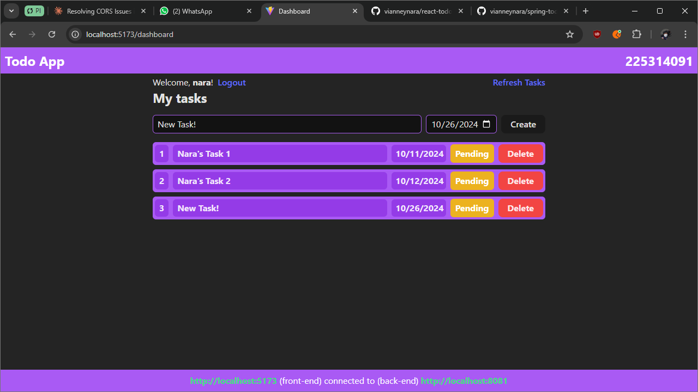       |
| Toggle | 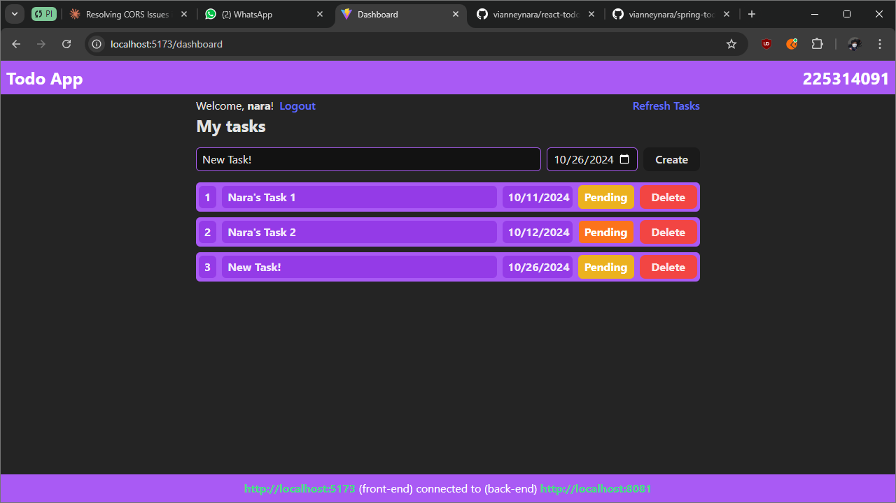 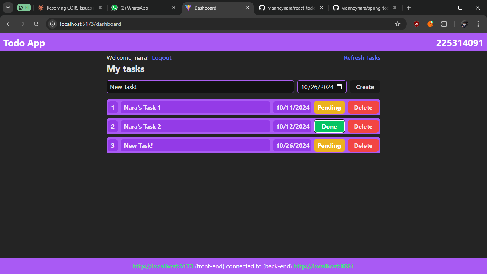 |
| Delete | 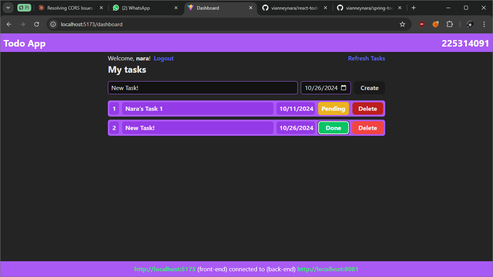 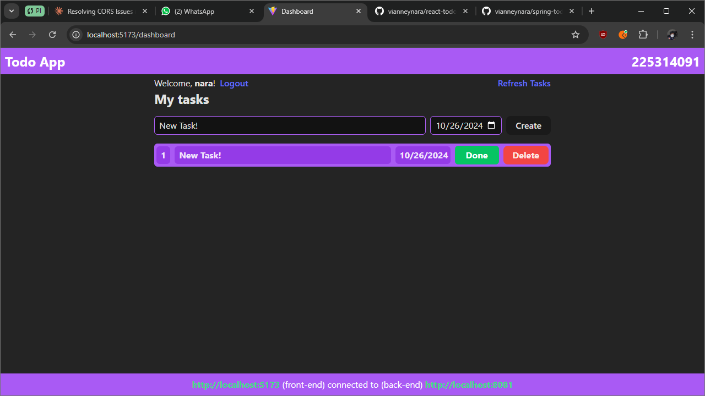 |